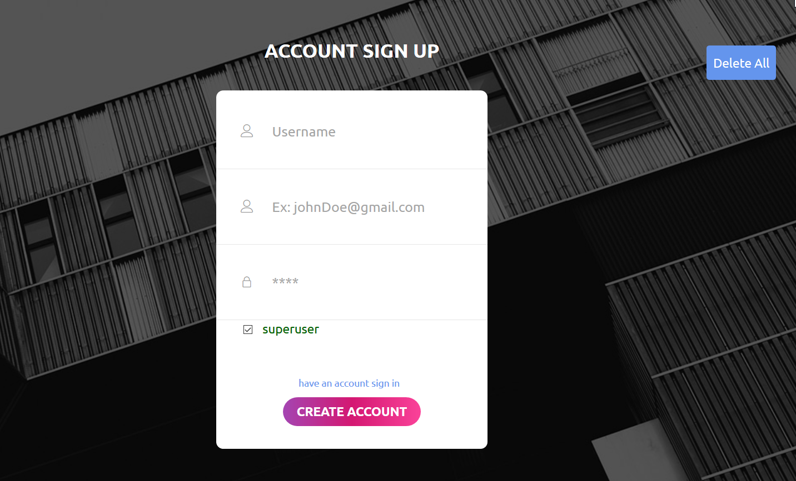
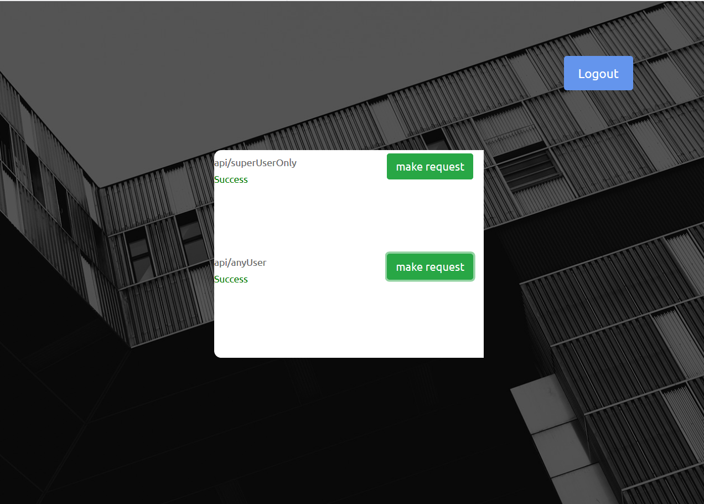
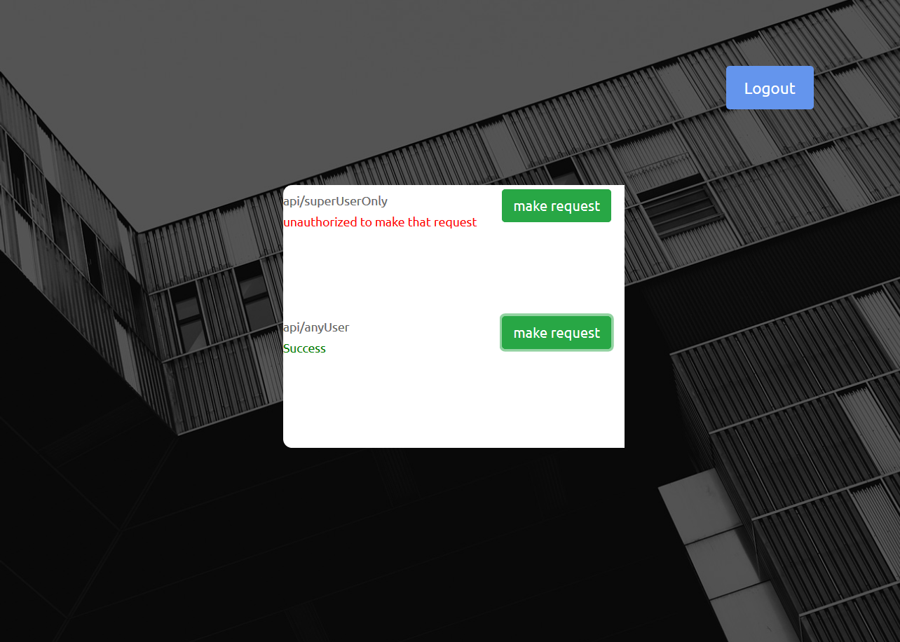

# superuser

superuser is a project I built to show JWT (authorization) in action on two separate servers.

## Description

superuser is a project to show how  1 server can be used for authentication using Passport.js localStrategey and then generateing a JWT for that user when they have logged in.

each user have the ability to make request to certain API's on running separate server (dataProvider).

superuser allowed is authorized to make any request they want but normal user is limited to only 1 api.

## How to Run

make sure to have mongoDB installed on your pc. 

after cloning the project.
open terminal write `cd authentication_server`.
`npm install`.
open another terminal on the same directory (superuser/).
`cd  dataProvider.
`npm install.

by default the authentication server runs on port 3000 and Data provider server runs on 4000 .
## How to Use
after both of npm installtions are over run `npm start` in each of both directories.
after going to localhost:3000.
create 2 accounts one of superuser and the other will be normal if you don't have the checkbox marked 
[check sign up page](#sign-up-page) and you will be redirected to login page after each sign up.

if you make request with superuser you should get this [result](#superuser-result).
and if you make request with normal user you should get this [result](#normal-user-result).

## Results 
## Sign up page

## superuser result 

## normal user result 

## Contributing
Pull requests are welcome. For major changes, please open an issue first to discuss what you would like to change.

